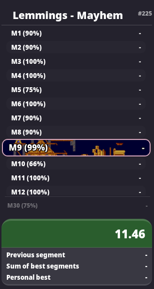

# Real Ann
A theme for the [Urn speedrun spliter](https://github.com/paoloose/urn) that uses images for split backgrounds based on the splits name.

 

---

## What it supports
- Most SM64 level shortenings without star count in split name.
- SM64 70 star intermediate route with star count in split name.
- Every SM64 Main category's WR route with star count in split name.
- Some extra split names for SM64 for slightly diffrent routes.
- Some alternative nameing in SM64 such as "Bowser 1" or "DW" for "BitDW".
- Some for all Lemmings levels of the "Fun" rating, and their repeats.

## What is planed to be supported
- Every Level in the game "Lemmings" with level names as split names.
- Some one-off things for games i, or my friends, enjoy running or watching.

## What is not planed to be supported 
- SM64 single star splits.

## Behaviour if no image is included for the split name
If the split name doesnt have a image assigned to it, it will default to a rounded grey background.

---
# Installation
1. Download the `urn-gtk.css` file and put it in Urn's root directory. (be sure to back up the old `urn-gtk.css` file)
2. Recompile Urn
``` bash
make && sudo make install
```

#### **Optional** 
3. For the best experience i recommend installing the [awd-gtk3-dark theme](https://github.com/lassekongo83/adw-gtk3) and use the provided `.desktop` file to force Urn to use it.

---

**Note:** Images are pulled as raw links from this Git repo over internet. Manual download of the images is not needed. This Also means that a internet connection is required for this theme to work, the reason this is done is because a local version of this theme would not be easy to achive due to the need for absolute links, and i do not want people to install this in root.
